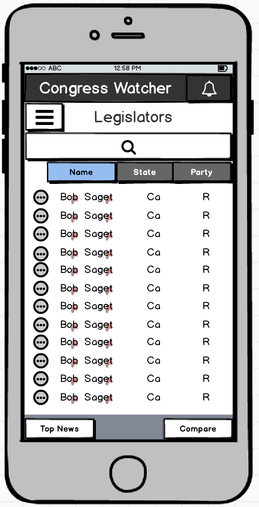
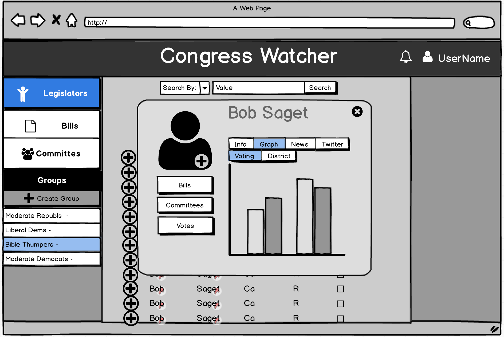
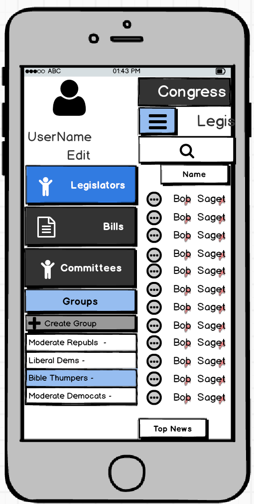
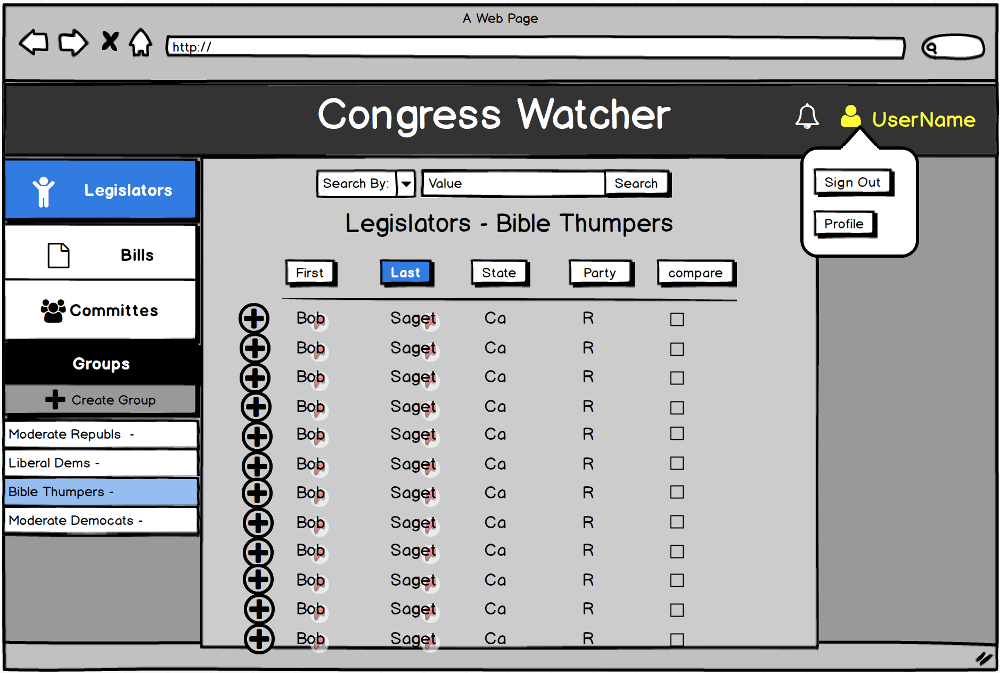

<table>
  <tr>
    <th>Action</th>
    <th>Mobile</th> 
    <th>Web</th>
  </tr>
  <tr>
    <td>Main</td>
    <td></td> 
    <td></td>
  </tr>

  <tr>
    <td>Legislator-Show</td>
    <td></td> 
    <td></td>
  </tr>

   <tr>
    <td>User-Show</td>
    <td></td> 
    <td></td>
   </tr>
   <tr>

    <td>Alert</td>
    <td></td>
    <td></td>
  </tr>

  <tr>
    <td>Add to Group</td>
    <td></td>
    <td></td>
  </tr>

  <tr>
    <td>Legislator-Show More</td>
    <td></td>
    <td></td>
  </tr>
</table>